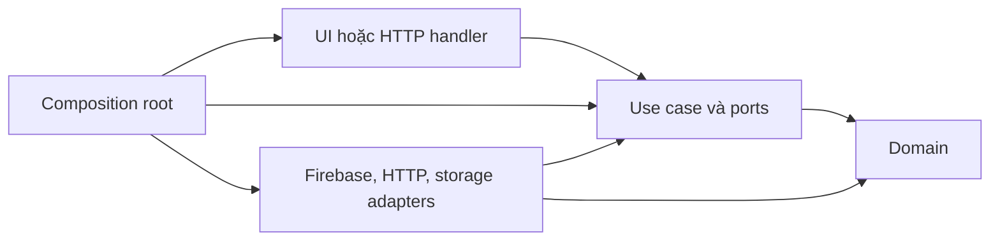

# Couple App — Clean Architecture theo feature cho KMP, Go và Next.js

- Ngày nghiên cứu: 28/09/2026.
- Cập nhật thư viện: 01/10/2026 — [Danh mục và điều kiện áp dụng](couple-app-library-recommendations.md).
- Quyết định ngày 02/10/2026: Firebase, KMP mới nhất và UI riêng Android/iOS. Triển khai đề xuất: Kotlin/KMP stable 2.4.20; Android Jetpack Compose + Navigation 3 stable 1.2.0; iOS SwiftUI + NavigationStack. “Mới nhất” được hiểu là stable, kiểm tra lại khi scaffold. [Kotlin releases](https://kotlinlang.org/docs/releases.html) · [Navigation 3 releases](https://developer.android.com/jetpack/androidx/releases/navigation3) · [Apple NavigationStack](https://developer.apple.com/documentation/swiftui/navigationstack)
- Trạng thái 05/10/2026: kiến trúc định hướng; đã tạo [source tối thiểu](../README.md) cho feature đếm ngày, Android/iOS host, Go và web. Các phần auth/data/admin bên dưới chưa triển khai.
- Ràng buộc: một người, khoảng 40 giờ/tuần, có AI hỗ trợ; Android/iOS; Go backend; Next.js landing/admin; ưu tiên Firebase.
- Liên quan: [Danh mục 53 feature](couple-app-product-operations-notes.md) · [Kế hoạch phát triển](couple-app-development-plan.md).

## 1. Kết luận và mức độ “chuẩn”

Không có cây thư mục Clean Architecture duy nhất được cả Kotlin, Go và Next.js quy định. Cần phân biệt quy ước chính thức của framework với lựa chọn kiến trúc của sản phẩm.

| Dự án | Đề xuất | Đơn vị chia chính |
|---|---|---|
| KMP | Feature-first, chia sẻ domain/data; presentation và navigation riêng: Compose Android, SwiftUI iOS | Một Gradle module cho một nhóm nghiệp vụ chung; UI chia theo feature ở mỗi host |
| Go | Modular monolith, feature-first, ports/adapters quanh nghiệp vụ | Package nghiệp vụ trong `internal`, một `go.mod` |
| Next.js | App Router cho route; feature-first cho UI và điều phối; tách server/client | Thư mục feature trong một ứng dụng Next.js |
| Toàn bộ | Một repository, ba phần build/deploy độc lập | `mobile`, `backend`, `web`, `contracts`, `docs` |

Clean Architecture yêu cầu phụ thuộc mã nguồn hướng về logic bên trong. Các tên thư mục chỉ là phương tiện; Firebase, HTTP, database và UI phải ở ngoài phần nghiệp vụ. [Bài gốc Clean Architecture](https://blog.cleancoder.com/uncle-bob/2012/08/13/the-clean-architecture.html)

Next.js không áp đặt cách tổ chức feature. Go có hướng dẫn `internal`/`cmd`, không bắt buộc cấu trúc controller-service-repository. Android khuyên tách UI/data, dùng repository và luồng dữ liệu một chiều; domain trong tài liệu Android là tùy chọn và không hoàn toàn cùng định nghĩa với domain của Clean Architecture. Các cấu trúc chi tiết bên dưới là đề xuất thích nghi cho app này. [Next.js](https://nextjs.org/docs/app/getting-started/project-structure) · [Go](https://go.dev/doc/modules/layout) · [Android domain](https://developer.android.com/topic/architecture/domain-layer)

## 2. Quy tắc kiến trúc dùng chung

1. Chia theo nhóm nghiệp vụ trước, các lớp nằm bên trong feature.
2. Domain gồm model, quy tắc và lỗi nghiệp vụ; không import Firebase, HTTP, Compose, React hoặc Next.js.
3. Use case điều phối một hành động; gọi interface/port do phía sử dụng cần, không gọi SDK trực tiếp.
4. Data/adapter chuyển đổi dữ liệu ngoài thành model nội bộ và thực hiện các port.
5. UI/handler nhận đầu vào và trình bày đầu ra; Go quyết định quyền và quy tắc có tính thẩm quyền.
6. Composition root khởi tạo và nối các implementation với interface.
7. Không gọi xuyên vào data/adapter của feature khác. Khi cần, dùng public contract nhỏ hoặc port và nối tại composition root.
8. Không tạo 53 module cho 53 dòng tính năng. Một module chứa nhiều feature sản phẩm có chung vòng đời dữ liệu.
9. Model API, model database và model domain tách tại ranh giới có khác biệt; không nhân bản mọi class chỉ để đủ số lớp.
10. Thư mục “core/shared” chỉ chứa phần thật sự dùng chung, không thành nơi gom mọi nghiệp vụ.

Sơ đồ dưới biểu diễn **phụ thuộc mã nguồn**, không phải thứ tự gọi runtime:



## 3. Repository tổng thể

```text
couple-app/
  mobile/
  backend/
  web/
  contracts/
    openapi.yaml
    examples/
  docs/
    architecture/
    decisions/
    product/
  firebase/
  infra/
```

- Mỗi phần có công cụ build và lock/version files riêng.
- OpenAPI mô tả DTO và giao thức; không dùng nó để chia sẻ domain class xuyên Kotlin/Go/TypeScript.
- Nếu sinh API client, code sinh đặt riêng và không sửa tay. Adapter chuyển DTO sang model feature.
- Chưa cần công cụ điều phối monorepo bổ sung; bắt đầu bằng các lệnh build/check rõ ràng.
- Tạo thư mục/module khi có code hoặc hợp đồng thật; các cây đầy đủ là đích tổ chức, không yêu cầu dựng mọi thư mục rỗng ngay.

## 4. App KMP

### 4.1. Cấu trúc đề xuất

```text
mobile/
  androidApp/                       # Jetpack Compose UI, ViewModel, Navigation 3
    features/auth/                  # AuthScreen, AuthViewModel (package trong source)
    navigation/                     # Android back stack, deep link
    designsystem/                   # Theme/components Android
  iosApp/                           # Xcode app, SwiftUI, Swift bridges, Widget extension
    Features/Auth/                  # AuthView, AuthViewModel Swift
    Navigation/                     # NavigationStack, route/path iOS
    DesignSystem/                   # Theme/components SwiftUI
    Platform/Firebase/              # Firebase Apple SDK adapters
  shared/                           # Shared facade, export Swift, composition; không chứa UI
  core/
    model/                          # ID/value type tối thiểu thực sự dùng chung
    network/                        # HTTP client, token provider port, lỗi vận chuyển
  feature/
    auth/
    profile/
    couple/
    anniversary/
    memory/
    social/
    assistant/
    settings/
  gradle/
    libs.versions.toml
  settings.gradle.kts
```

`androidApp`, `shared` và mỗi thư mục module thuộc `core`/`feature` là Gradle project khi được tạo; `iosApp` là Xcode project. `core` và `feature` chỉ là thư mục nhóm. Khởi đầu chỉ cần auth và các core thực sự cần cho auth; các nhóm sau tạo theo roadmap.

Cấu trúc trên là đề xuất của dự án cho hai UI native. KMP chia sẻ domain, use case, repository, API client và mapping; mỗi host giữ UI, navigation và lifecycle của mình. Giữ default source-set hierarchy nếu không có nhu cầu đặc biệt. [Chia sẻ code KMP](https://kotlinlang.org/docs/multiplatform/multiplatform-share-on-platforms.html) · [Hierarchy](https://kotlinlang.org/docs/multiplatform/multiplatform-hierarchy.html)

Ví dụ một Gradle module `:feature:auth`:

```text
feature/auth/
  build.gradle.kts
  src/
    commonMain/kotlin/<package>/auth/
      domain/
        model/AuthSession.kt
        repository/AuthRepository.kt
        usecase/EnsureSession.kt
        usecase/LinkIdentity.kt
        error/AuthFailure.kt
      data/
        repository/FirebaseAuthRepository.kt
        platform/IdentityGateway.kt
        remote/ProfileApi.kt
        mapper/ProfileMapper.kt
      wiring/
        AuthFeatureFactory.kt
    androidMain/kotlin/<package>/auth/
      data/platform/AndroidIdentityGateway.kt
    iosMain/kotlin/<package>/auth/
      data/platform/IosIdentityGatewayAdapter.kt
    commonTest/kotlin/<package>/auth/
```

Đây là sơ đồ thư mục, `<package>` sẽ thay bằng package thực khi scaffold. Không phải mọi model đều cần thư mục riêng nếu chỉ có một file.

### 4.2. Ranh giới các lớp

| Lớp | Được làm | Không được làm |
|---|---|---|
| domain | Model, interface repository, use case, quy tắc thuần | Import FirebaseUser, Activity, Swift SDK, HTTP DTO hoặc Compose |
| data | Firebase/API/cache adapter, mapping và repository implementation | Phụ thuộc ViewModel hoặc UI |
| presentation ở từng host | Compose/Android ViewModel hoặc SwiftUI/Swift ViewModel; UI state/actions gọi shared facade/domain contract | Gọi Firebase SDK trực tiếp từ màn hình hoặc chứa lại quy tắc nghiệp vụ đã có trong shared |
| wiring/shared | Tạo implementation và truyền dependency | Chứa quy tắc nghiệp vụ hoặc trở thành service locator toàn cục |

Repository interface thuộc domain trong lựa chọn Clean Architecture này. Đây là lựa chọn cho dự án, không khẳng định cây phụ thuộc giống hệt ví dụ domain tùy chọn của Android.

Use case có giá trị với `EnsureSession`, `LinkIdentity`, `AcceptInvitation`, `PublishSharedMemory`. Không cần class use case chỉ để chuyển nguyên một dòng gọi hàm, nếu không thêm quy tắc hoặc điều phối. ViewModel có thể dùng domain repository interface cho truy vấn đơn giản.

### 4.3. State và nền tảng

- Android ViewModel và Swift ViewModel giữ UI state riêng; UI phát action; dữ liệu thay đổi đi qua shared use case/repository. Quy tắc đếm ngày, quyền và chuyển trạng thái nghiệp vụ không viết lại trong hai ViewModel.
- Shared dùng coroutines/Flow khi cần; Swift facade phải chuyển kết quả/lỗi rõ ràng, có cơ chế hủy observation/task và cập nhật UI trên MainActor. Kiểm chứng bridge trước khi chọn thêm thư viện interop; không giả định Swift tự consume Flow như AsyncSequence.
- Navigation 3 ở Android; NavigationStack ở iOS. Hai back stack độc lập, dùng cùng quy ước deep link và business ID. Shared không giữ NavController, NavigationPath hoặc tham chiếu view.
- Google/Apple UI mở từ host nền tảng; adapter trả kết quả/hủy/lỗi về contract. Không truyền SDK credential hoặc loại giao diện nền tảng vào domain.
- Firebase SDK Android ở `androidMain`/Android host. Firebase Apple có thể cần Swift bridge ở `iosApp/Platform/Auth`, triển khai port do Kotlin export; `iosMain` điều phối nếu cần.
- Một Swift adapter không phải là Kotlin `actual` class. Kiểm tra interop, export protocol, callbacks và cancellation trong thử kỹ thuật trước khi cố định chi tiết bridge.
- `shared` chỉ export các contract/entry point mà Swift cần; không export toàn bộ nội bộ feature.
- Domain có thể dùng thư viện Kotlin đa nền tảng thuần như coroutines; tránh buộc vào engine HTTP hoặc SDK nền tảng.

Android khuyên UI không truy cập data source trực tiếp, dùng UDF, repository và constructor injection. Dự án chọn ViewModel theo host để giữ lifecycle rõ ràng; chưa dùng shared ViewModel. [Android recommendations](https://developer.android.com/topic/architecture/recommendations)

### 4.4. Module và dependency

- Đề xuất: **một Gradle module cho một nhóm feature chung**, trong đó tách package domain/data/wiring; presentation chia theo feature ở Android host và iOS host.
- Việc này không tự tạo compiler boundary giữa domain/data trong một module. Cần rule kiểm tra import trong CI; Kotlin `internal` chỉ bảo vệ biên module, không bảo vệ giữa package cùng module.
- Khi cần biên biên dịch mạnh hơn, tách `:feature:auth:domain` khỏi phần implementation. Chỉ làm khi cần, không tạo ba module cho mọi feature ngay đầu.
- Feature A không import ViewModel/repository implementation của feature B.
- Thông tin phiên dùng chung được cung cấp qua contract nhỏ. `core:network` định nghĩa `TokenProvider`, composition root gắn implementation từ auth; network không import auth để tránh vòng phụ thuộc.
- Dependency injection giữ constructor rõ ràng. Sau nghiên cứu thư viện ngày 01/10, đề xuất Koin tại `wiring`/shared/host để nối dependency; domain không import container. Factory thủ công vẫn phù hợp với bài thử nhỏ; không áp dụng Hilt của Android vào commonMain/iOS. [Đánh giá Koin](couple-app-library-recommendations.md)

Modularization cần cân đối lợi ích với độ phức tạp; hướng dẫn Android không yêu cầu mọi dự án có cùng số module. [Nguồn](https://developer.android.com/topic/modularization)

### 4.5. Kiểm thử

- `commonTest`: quy tắc đếm ngày, auth state machine, use case với fake repository/gateway.
- Test nền tảng: Google/Apple, native cancellation, token refresh, widget và lifecycle.
- Test dữ liệu: link giữ UID, mất mạng giữa link và sync, không tạo cặp/hồ sơ trùng.
- Test UI quan trọng: Anonymous đi tới màn hình chính; liên kết thành công/hủy/xung đột; không mất bản nháp.
- Chạy test UI Android và iOS riêng; kiểm tra back gesture, deep link, restoration và cancellation khi đóng màn hình. Test nghiệp vụ dùng chung không thay thế test SwiftUI.

## 5. Backend Go

### 5.1. Chọn modular monolith, feature-first

Một Go module; API và worker có thể là hai binary dùng chung package nghiệp vụ. Chưa chia thành microservices hay một `go.mod` cho mỗi feature.

```text
backend/
  go.mod
  go.sum
  cmd/
    api/main.go
    worker/main.go                  # Chỉ tạo khi có job thật
  internal/
    bootstrap/                      # Nối dependency, router, lifecycle
    identity/
      domain/
        principal.go
        errors.go
      application/
        ensure_profile.go
        ports.go
      adapter/
        httpapi/
        firebaseauth/
        persistence/                # Driver cụ thể chọn lúc lưu dữ liệu
    couple/
      domain/
      application/
      adapter/
    anniversary/
    memory/
    social/
    assistant/
    moderation/
    privacy/
    platform/
      config/
      logging/
      httpserver/
      firebaseclient/
  tests/integration/
```

Tên các feature theo nghiệp vụ, các layer là package bên trong feature. Khi import các package trùng tên `domain`/`application`, dùng alias có nghĩa như `coupledomain`. Không thêm `pkg/` nếu không cung cấp thư viện cho dự án bên ngoài.

Go chính thức khuyến nghị đặt server logic trong `internal`, có thể đặt command ở `cmd`. `internal` giới hạn import theo cây thư mục, nhưng không tự ngăn hai feature cùng backend import nội bộ của nhau. [Go module layout](https://go.dev/doc/modules/layout)

### 5.2. Trách nhiệm và luồng gọi

```text
HTTP request
  → xác minh Firebase token
  → handler parse/validate request
  → application use case kiểm tra quyền và điều phối
  → domain áp dụng quy tắc
  → repository port / adapter lưu dữ liệu
  → mapper trả response
```

Đây là luồng runtime. Import đi theo rule ở mục 2: adapter biết application/domain; application không biết Firebase/Firestore/router.

- Domain: dữ liệu và quy tắc, ví dụ lời mời hết hạn hay thay phạm vi chia sẻ làm hết hiệu lực phê duyệt.
- Application: hành động như `AcceptInvitation`, `DisconnectCouple`, `PublishMemory`; nhận actor đã xác minh và vẫn kiểm tra quyền trên đối tượng.
- Port nhỏ đặt trong package sử dụng, thường là application: `InvitationStore`, `Clock`, `TokenVerifier`, `NotificationQueue` khi có use case cần.
- Adapter: Firebase Admin, HTTP handler, database và push implementation. Firebase token type được map sang `Principal` nội bộ.
- Bootstrap: tạo client, adapter, service rồi gắn route; không gọi constructor từ khắp domain.

### 5.3. Quy ước phù hợp Go

- Dùng `net/http`; sau nghiên cứu ngày 01/10, đề xuất thêm chi cho route group/middleware theo feature, giữ router trong adapter/bootstrap. Nghiệp vụ không phụ thuộc chi. [Đánh giá thư viện Go](couple-app-library-recommendations.md)
- Constructor injection thủ công; hàm và struct cụ thể, không cần DI container.
- Interface nhỏ do bên sử dụng định nghĩa; không có `IUserService`/interface cho mọi struct.
- Không bắt mỗi use case thành một class. Hàm/method và file theo hành động là đủ.
- `context.Context` truyền qua thao tác I/O; lỗi nghiệp vụ được adapter ánh xạ sang HTTP code.
- Transaction nằm sau port đúng nghiệp vụ, không truyền transaction type của database vào domain.
- Quy tắc như “một tài khoản chỉ có một cặp đang hoạt động” phải được bảo vệ trong transaction/ràng buộc lưu trữ, không chỉ kiểm tra trước rồi ghi.
- Khi nhiều feature phối hợp, dùng port hoặc workflow có trách nhiệm rõ; không để social trực tiếp đọc/sửa kho dữ liệu của couple.

Go khuyến nghị interface ở phía dùng và tránh tạo interface khi chưa có nhu cầu thực. [Go Code Review Comments](https://go.dev/wiki/CodeReviewComments#interfaces) · [net/http](https://pkg.go.dev/net/http)

### 5.4. Firebase, identity và web session

- Mobile gửi Firebase ID token; adapter Go xác minh, không tin UID từ request body.
- Anonymous vẫn là người dùng đã xác thực; loại tài khoản không tự quyết định toàn bộ quyền.
- Nghiệp vụ không dùng email làm khóa định danh và không tự gộp vì email trùng.
- Phần liên kết provider diễn ra trong client Firebase flow. Go đồng bộ profile sau khi xác minh, không tự giả lập linking bằng đổi UID trong DB.
- Admin dùng phiên đã được cấp quyền. Nếu chọn Firebase session cookie, adapter xác minh session cookie riêng; không dùng hàm xác minh ID token cho cookie.
- Firestore nếu được chọn qua server SDK vẫn cần kiểm tra quyền trong Go; rules phía client không thay cho việc này.

### 5.5. Kiểm thử

- Unit test cạnh code bằng `*_test.go`: domain và application với fake port, clock kiểm soát được.
- HTTP test xác minh validation, mapping lỗi và quyền truy cập.
- Integration test adapter với môi trường thử phù hợp; kiểm tra retry và giao dịch đồng thời.
- Trường hợp ưu tiên: hai lời mời được chấp nhận cùng lúc, ngắt cặp trong khi đăng bài, quyền admin bị thu hồi, link provider bị xung đột.

## 6. Web Next.js

### 6.1. Cấu trúc đề xuất

```text
web/
  src/
    app/
      layout.tsx
      (marketing)/
        page.tsx
        privacy/page.tsx
        support/page.tsx
      invite/[token]/page.tsx
      admin/
        login/page.tsx
        (protected)/
          layout.tsx
          page.tsx
          reports/page.tsx
          users/page.tsx
          content/page.tsx
      api/session/route.ts          # Chỉ nếu cần endpoint phiên cho browser
    features/
      auth/
      invitation/
      moderation/
        domain/
          report.ts
        application/
          resolve-report.ts
          report-repository.ts
        data/
          go-report-repository.server.ts
          report-mapper.ts
        presentation/
          report-table.tsx
          resolve-report-form.client.tsx
        server.ts
        client.ts
      user-management/
      content-management/
    composition/
      moderation.server.ts
    lib/
      auth/
        session.server.ts
        firebase.client.ts
      api/
        go-client.server.ts
      env/
    components/ui/
  public/
  tests/e2e/
  package.json
```

`(marketing)` và `(protected)` là route groups, không xuất hiện trong URL; `/admin` là segment thật. Landing tĩnh có thể giữ component gần route mà không cần tạo đủ domain/application/data cho từng section.

Next.js cung cấp quy ước routing và hỗ trợ tổ chức file linh hoạt. `app` ở đây giữ route/page/layout/loading/error và lớp chuyển tiếp mỏng; `features` chứa mã theo chức năng. [Nguồn](https://nextjs.org/docs/app/getting-started/project-structure)

### 6.2. Clean Architecture vừa đủ cho admin

- Domain ở web chứa model/validation phục vụ giao diện, không sao chép chính sách nghiệp vụ có thẩm quyền từ Go.
- Application điều phối tác vụ admin qua port khi có logic đáng kể. Trang chỉ đọc dữ liệu đơn giản có thể gọi query adapter server qua composition, không cần thêm use case chuyển tiếp vô nghĩa.
- Data chứa Go API client và mapping DTO. Không đọc/ghi trực tiếp cơ sở dữ liệu nghiệp vụ để bỏ qua Go.
- Presentation chứa component/form và state UI; client component không import server adapter.
- Composition nối use case và adapter, dùng function/factory TypeScript; không cần DI container hoặc class cho mọi thao tác.

### 6.3. Biên server/client

- Mặc định dùng Server Components cho khung/trang đọc dữ liệu; chỉ dùng `'use client'` ở phần tương tác như form và Firebase sign-in browser.
- File `.server.ts` là quy ước dễ đọc, không tự bảo vệ code. Module nhạy cảm phải có `import 'server-only'` và kiểm tra import/build.
- Tách `server.ts` và `client.ts` export. Không dùng một barrel `index.ts` trộn session secret và component client.
- Credential quản trị/secret không đưa vào `NEXT_PUBLIC_*`; cấu hình Firebase client công khai không phải service-account credential.
- Dữ liệu quản trị không cache chung giữa người dùng; kiểm tra session/quyền cho mỗi operation, không chỉ ở layout.
- Server Actions/Route Handlers là điểm vào cần xác thực, kiểm tra đầu vào và quyền như API. Go kiểm tra quyền nghiệp vụ lại.
- Mutation từ browser qua Next.js cần bảo vệ CSRF/origin theo cơ chế phiên đã chọn.

Next.js phân biệt Server/Client Components và hỗ trợ `server-only` để bắt lỗi import sang client. Hướng dẫn auth cũng phân biệt kiểm tra điều hướng với kiểm tra truy cập dữ liệu thực sự. [Server/client](https://nextjs.org/docs/app/getting-started/server-and-client-components) · [Auth](https://nextjs.org/docs/app/guides/authentication)

### 6.4. Luồng quản trị mẫu

```text
Browser admin
  → Next.js page/action/route
  → lớp session và composition server
  → use case hoặc query adapter của feature
  → Go admin API xác minh phiên và quyền
  → xử lý nghiệp vụ, audit
```

Không tự tạo database tài khoản admin riêng biệt. Firebase xác thực; quyền admin được cấp và kiểm tra ở phía máy chủ. Tài khoản Google/Apple thông thường và Anonymous không được mặc định có quyền admin.

## 7. Các nhóm feature và quyền sở hữu

| Nhóm | Mobile | Go | Next.js |
|---|---|---|---|
| Danh tính | auth: Anonymous/link/đăng nhập | identity: xác minh/profile sync | auth quản trị |
| Hồ sơ | profile | identity/profile theo mô hình thực tế | user-management |
| Cặp đôi | couple | couple, lời mời và thành viên | invitation, hỗ trợ có phân quyền |
| Đếm ngày | anniversary | anniversary, nhắc dịp | Quản lý nội dung hỗ trợ nếu cần |
| Kỷ niệm | memory | memory và media | Xem nội dung được báo cáo theo quyền |
| Social | social | social | moderation |
| AI | assistant | assistant | Cấu hình/đánh giá khi triển khai |
| Riêng tư | settings | privacy và audit | Công cụ hỗ trợ theo quyền |

Không cần cây feature giống hệt giữa ba dự án. Mobile và admin có nhiệm vụ khác nhau; Go giữ tính nhất quán nghiệp vụ.

## 8. Flow mẫu: Anonymous → liên kết Google/Apple

1. App host/composition khởi tạo IdentityGateway nền tảng.
2. `EnsureSession` qua `AuthRepository` khôi phục phiên hoặc tạo Anonymous.
3. Data adapter chuyển Firebase user thành `AuthSession` của domain.
4. Network lấy ID token qua port và gọi Go để đồng bộ profile.
5. Người dùng bấm liên kết; presentation đề nghị host mở Google/Apple, nhận kết quả qua gateway.
6. Link provider vào phiên hiện tại; thành công đồng bộ cùng UID, hủy thì giữ phiên cũ.
7. Credential đã thuộc tài khoản khác trả `AuthFailure.AccountConflict`; UI đưa lựa chọn rõ ràng, không tự đổi phiên/xóa dữ liệu.
8. Go xác minh danh tính và cập nhật hồ sơ theo thao tác lặp lại an toàn; không tự thay membership cặp đôi.

Các kiểu FirebaseUser, OAuth credential và lỗi SDK không vượt vào domain/UI. Error mapping giữ đủ thông tin để phân biệt hủy, lỗi mạng, hết phiên và xung đột nhưng không ghi token/nội dung riêng tư vào log.

## 9. Kiểm soát kiến trúc trong CI

| Phần | Rule cần kiểm tra |
|---|---|
| KMP | domain không import data/presentation/Firebase/HTTP/Compose; presentation không import implementation; module graph không có cycle |
| Go | domain/application không import SDK hoặc adapter; feature không import persistence của feature khác; format/vet/test phù hợp |
| Next.js | client không import server-only; feature không đi ngược vào app routes; không import nội bộ feature khác tùy tiện; typecheck/lint/build |
| API | OpenAPI và implementation/client tương thích; lỗi/ID/time có định nghĩa thống nhất |
| Bảo mật dữ liệu | Kiểm tra quyền qua API, link/merge conflict, secret không xuất hiện ở client/log |

Khi dùng một module cho nhiều lớp, kiểm tra import phải là công cụ thực sự phân tích code/dependency, không chỉ một quy ước trong README. Chọn công cụ phù hợp lúc dựng CI; không bắt buộc thêm nền tảng trả phí.

## 10. Những lựa chọn nên tránh ở giai đoạn này

- Một `data/`, `domain/`, `presentation/` toàn app chứa mọi feature lẫn nhau.
- Một module cho mỗi dòng feature hoặc mỗi use case.
- `BaseRepository<T>`, `BaseUseCase`, `BaseViewModel` chứa nhiều hành vi dùng chung chưa được chứng minh cần thiết.
- Một `FirebaseService` xử lý auth, ảnh, social, quyền và analytics của toàn hệ thống.
- Dùng DTO HTTP làm model domain khắp app.
- Ép cấu trúc class của Kotlin sang Go; tạo interface chỉ để có interface.
- Tạo backend nghiệp vụ thứ hai trong Next.js.
- Đánh đồng thư mục riêng, private route group hoặc tên `.server.ts` với kiểm soát bảo mật.
- Tự xây event bus/CQRS/microservices trước khi có nhu cầu cụ thể.

## 11. Đề xuất để chốt ngày 1–2

| Quyết định | Đề xuất |
|---|---|
| Repo | Một repo, ba project độc lập |
| Mobile UI | Android Jetpack Compose + Navigation 3; iOS SwiftUI + NavigationStack; UI/navigation riêng |
| Mobile module | Một module/nhóm feature domain/data chung; UI feature ở host; kiểm tra import |
| Mobile DI | Constructor injection; đề xuất Koin tại wiring/shared/host, domain độc lập container |
| Go | Một module; `cmd`, `internal/<feature>`, ports/adapters; `net/http` + chi tại lớp HTTP |
| Next.js | App Router + features, server/client exports tách rõ |
| Firebase | SDK ở adapter; Firebase là triển khai danh tính/dịch vụ, không là domain model |
| Data contract | OpenAPI, DTO riêng với domain |
| Feature đầu | Auth + profile sync, chưa scaffold mọi feature |
| Acceptance đầu | Anonymous/link Google/Apple trên hai nền tảng; UID và dữ liệu không mất; API/admin kiểm tra quyền |

Phạm vi tài liệu là cấu trúc kiến trúc. Hành vi xung đột account linking và quyền quản trị vẫn phải được đặc tả/test theo [kế hoạch](couple-app-development-plan.md); kiến trúc không thay cho việc chốt quy tắc sản phẩm.
