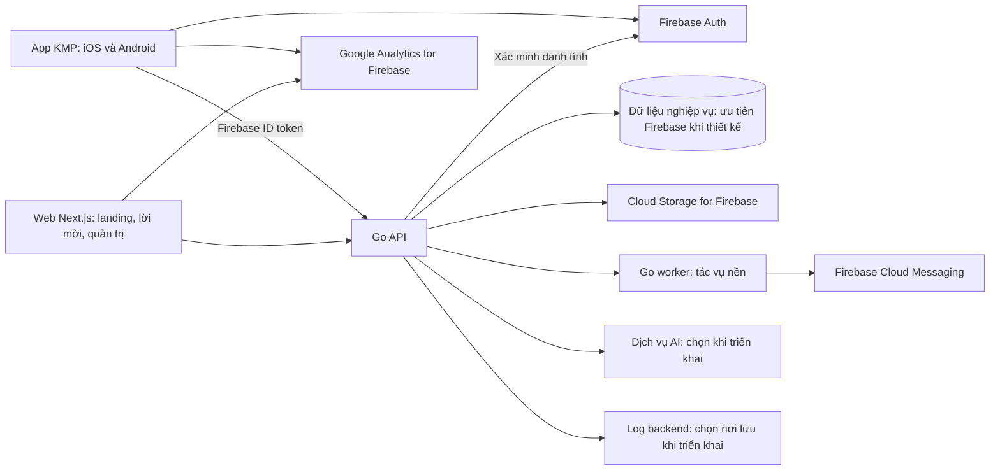
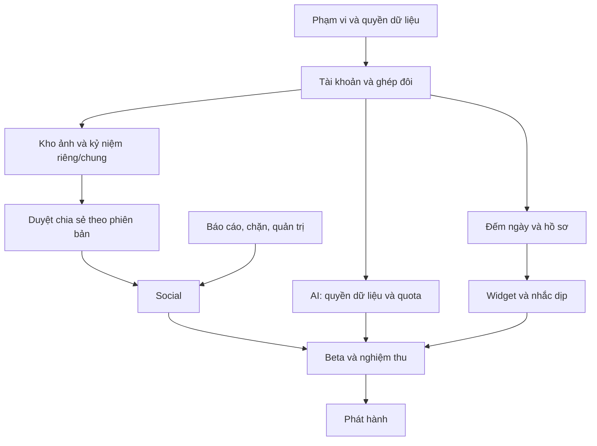

# Kế hoạch phát triển Couple App — KMP + Go + Next.js

- Cập nhật: 02/10/2026 — UI riêng hai nền tảng; KMP chia sẻ logic/data. Lịch 36–44 tuần bên dưới là baseline cũ dùng UI chung, cần ước lượng lại sau prototype hai UI; chưa phải cam kết cho phương án mới.
- Trạng thái 05/10/2026: đã bắt đầu [repo local và feature đếm ngày](../README.md). Xem [kết quả kiểm chứng](bootstrap-status.md); các mốc sản phẩm vẫn là kế hoạch, chưa nghiệm thu toàn sprint.
- Công nghệ đã xác nhận: app KMP, backend Go (Golang), web Next.js.
- UI đã xác nhận: viết riêng Android/iOS. Đề xuất triển khai Android Jetpack Compose + Navigation 3, iOS SwiftUI + NavigationStack; dùng Kotlin/KMP và navigation bản stable mới nhất tương thích. Snapshot phiên bản tại [kiến trúc](couple-app-clean-architecture.md).
- Nguồn lực đã xác nhận: một người phát triển, có AI hỗ trợ.
- Thời gian đã xác nhận: khoảng 40 giờ/tuần; làm cả Android và iOS.
- Auth đã xác nhận: Firebase Anonymous trước, Google và Apple để liên kết tự nguyện.
- Dịch vụ: ưu tiên Firebase cho các khả năng phù hợp; chỉ đề xuất nền tảng khác khi có nhu cầu triển khai cụ thể.
- Phạm vi web đã xác nhận: landing page và trang quản trị; các trang mời/hỗ trợ là phần phụ trợ cho app.
- Yêu cầu source đã xác nhận: Clean Architecture, chia theo feature. Cấu trúc chi tiết đề xuất tại [Kiến trúc KMP, Go, Next.js](couple-app-clean-architecture.md).
- Thư viện đề xuất: [Nghiên cứu KMP, Go, Next.js](couple-app-library-recommendations.md). Có phân loại dùng ban đầu/theo feature/thử trước, ranh giới kiến trúc và ước lượng kiểm chứng nền móng 40–68 giờ trong giai đoạn đầu; chưa cài đặt hoặc khóa phiên bản.
- Tài liệu nguồn: [53 tính năng, luồng người dùng, analytics và vận hành](couple-app-product-operations-notes.md).
- Triển khai giai đoạn đầu: [Checklist và sprint 01 — 80 giờ](couple-app-sprint-01.md). Tài liệu này thay lịch khởi động sơ bộ trước đây, có ticket, phụ thuộc và tiêu chí nghiệm thu cho hai UI riêng.
- Thời gian dưới đây là ước lượng lập kế hoạch, không phải benchmark hoặc cam kết ngày phát hành.

## 1. Kết quả cần đạt

Ra mắt một ứng dụng iOS/Android có đủ ba giá trị:

1. Đếm ngày và lưu kỷ niệm riêng tư cho cặp đôi.
2. Chia sẻ với bạn bè, có quyền riêng tư và kiểm duyệt.
3. AI giúp lên ý tưởng hẹn hò và diễn đạt lời nhắn.

Web Next.js phục vụ landing page và quản trị theo xác nhận của chủ sản phẩm; kèm các trang phụ trợ link mời, hỗ trợ/chính sách. Không xây bản web người dùng tương đương app trong kế hoạch này.

## 2. Giả định để tính thời gian

Phương án cơ sở dùng để lập lịch:

- Một người phát triển với AI hỗ trợ, tự đảm nhiệm thiết kế cơ bản, tích hợp, kiểm thử và vận hành.
- Làm khoảng 40 giờ/tuần theo xác nhận; mức độ quen công nghệ chưa được xác nhận.
- Dùng bộ thành phần giao diện nhất quán, giới hạn độ tùy biến; thay đổi lớn đưa sang đợt tiếp theo.
- Giả định đã quen công nghệ chính, có máy Mac và thiết bị iOS/Android thật.
- Tiếng Việt trước; ảnh và chữ trước, chưa có video/livestream hoặc chat/gọi đầy đủ.
- Firebase Anonymous, Google và Apple nằm trong v1. Người dùng mới vào bằng Anonymous và liên kết khi muốn; người dùng cũ có lối đăng nhập để khôi phục tài khoản đã liên kết.
- 2–3 theme cơ bản và một kiểu widget trên mỗi nền tảng.
- AI gọi dịch vụ có sẵn, chưa tự huấn luyện mô hình; không tích hợp đặt bàn, thanh toán quà hay cơ sở dữ liệu địa điểm trực tiếp.
- Bản đầu chưa thu phí; thuê bao là giai đoạn sau.
- Web cơ sở chưa có bộ màn hình người dùng đầy đủ như app.

Nguồn lực, 40 giờ/tuần, Android/iOS, UI riêng, phạm vi web và hướng auth đã xác nhận. Mức độ quen Kotlin/Compose và Swift/SwiftUI cần kiểm chứng. Ước lượng lại cuối hai tuần đầu bằng thời gian thực hiện cùng luồng auth/home trên hai UI; phần UI/QA không mặc định được chia sẻ nhờ KMP.

## 3. Kiến trúc và phân chia trách nhiệm



### App KMP

- Android dùng Jetpack Compose, iOS dùng SwiftUI; chia sẻ domain/use case/data qua KMP. Navigation theo host: Navigation 3 và NavigationStack. Không đặt màn hình hoặc back stack trong commonMain.
- Chia sẻ logic đếm ngày, trạng thái tính năng, gọi API, cấu trúc dữ liệu và xử lý bản nháp.
- Dành phần tích hợp riêng cho widget, push, ảnh, sinh trắc học, chia sẻ hệ thống, link mời và lưu thông tin đăng nhập an toàn.
- Widget iOS có phần WidgetKit/SwiftUI; không ước lượng rằng mọi thứ đều chỉ viết một lần bằng Kotlin.
- Xây và thử iOS/Android ngay từ nền móng; không để iOS tới cuối dự án.
- Tạo interface auth/analytics/push trong phần chung; tích hợp SDK Firebase Android/iOS qua adapter nền tảng. Không coi SDK Kotlin dành cho Android là tự dùng được trực tiếp trong toàn bộ commonMain.

KMP cho phép chia sẻ code giữa nền tảng. Phương án này dùng shared logic với hai UI native, cần kiểm chứng cầu nối Swift, lifecycle và kiểm thử riêng từng UI. [Nguồn Kotlin](https://kotlinlang.org/docs/multiplatform/multiplatform-share-on-platforms.html) · [WidgetKit](https://developer.apple.com/documentation/widgetkit/creating-a-widget-extension)

### Backend Go

- Một hệ thống backend chia module theo nghiệp vụ; triển khai API và worker, chưa cần tách nhiều dịch vụ độc lập.
- Module: identity, couples, anniversaries, memories/media, social, notifications, AI, moderation/admin, audit và privacy.
- Ưu tiên xem xét Firestore khi bắt đầu thiết kế dữ liệu nghiệp vụ; chưa chốt PostgreSQL hay dịch vụ cơ sở dữ liệu ngoài Firebase. Cloud Storage for Firebase cho ảnh; chọn cách chạy job bền vững khi triển khai nhắc nhở/xử lý ảnh.
- API REST và đặc tả OpenAPI dùng chung cho mobile và web.
- Go là nơi quyết định quyền truy cập và trạng thái nghiệp vụ. Mobile/web không tự quyết định quyền chỉ bằng ẩn nút.
- Ghép đôi, duyệt chia sẻ và ngắt ghép đôi cần xử lý giao dịch, tranh chấp đồng thời, retry và chống thao tác trùng.
- Khóa AI giữ ở backend; áp dụng quota, timeout, giới hạn chi phí và kiểm tra đầu ra.
- Go xác minh Firebase ID token bằng Firebase Admin SDK, lấy UID đã xác minh và kiểm tra quyền nghiệp vụ. Không tin UID do client tự gửi; không tự xây hệ thống mật khẩu hoặc một hệ danh tính song song.
- Nếu dùng Firestore qua server SDK, Go phải thực thi kiểm tra quyền vì server SDK không chịu Firebase Security Rules như client SDK. Chưa mở quyền đọc/ghi trực tiếp từ app trừ khi có thiết kế và rules rõ ràng.

Go có cơ chế transaction để nhóm thay đổi cơ sở dữ liệu thành một đơn vị thành công hoặc thất bại cùng nhau. Thiết kế ràng buộc cụ thể vẫn phải được kiểm tra theo nghiệp vụ. [Nguồn Go](https://go.dev/doc/database/execute-transactions)

Tài liệu transaction SQL ở trên là tham khảo khái niệm, không chốt dùng SQL. Khi chọn Firestore hoặc kho dữ liệu khác sẽ dùng transaction/ràng buộc phù hợp. [Firebase xác minh ID token, có Go](https://firebase.google.com/docs/auth/admin/verify-id-tokens) · [Firestore server SDK và Security Rules](https://firebase.google.com/docs/firestore/security/rules-conditions)

### Web Next.js

- Landing page, giới thiệu tính năng, link tải app.
- Trang nhận link mời và mã dự phòng khi người dùng chưa cài app.
- Trang chính sách, hỗ trợ và hướng dẫn xuất/xóa tài khoản.
- Trang quản trị: đăng nhập, vai trò, danh sách báo cáo, xử lý/kháng nghị, audit, nội dung và dashboard vận hành.
- Không sao chép logic cặp đôi/phân quyền sang một backend nghiệp vụ thứ hai trong Next.js.
- Phiên web, bảo vệ yêu cầu thay đổi và quyền quản trị cần được kiểm tra ở máy chủ; ẩn giao diện hoặc kiểm tra đường dẫn là chưa đủ.

[Next.js: authentication và authorization](https://nextjs.org/docs/app/guides/authentication). Link mời còn cần cấu hình miền với từng nền tảng, ví dụ [Android App Links](https://developer.android.com/training/app-links/about).

### 3.1. Làm app, backend và web trong cùng repository

Đề xuất một repository cho một người phát triển, với ba phần có thể build và triển khai độc lập:

```text
couple-app/
  mobile/                 # Logic/data KMP chung; Android Compose và iOS SwiftUI riêng
  backend/                # Go API, module nghiệp vụ, worker và kiểm thử
  web/                    # Một dự án Next.js: landing + /admin + trang phụ trợ
  contracts/
    openapi.yaml          # Hợp đồng API chung cho mobile và web
  docs/                   # Kế hoạch, feature, luồng, quyền, tracking
  firebase/               # Cấu hình/rules/emulator khi bắt đầu tích hợp
  infra/                  # Cấu hình triển khai khi cần
```

- Cùng repository để AI và người phát triển xem được trọn luồng, đồng bộ thay đổi API, tính năng và tài liệu.
- Mobile build bằng bộ công cụ Kotlin/Android/Xcode; Go và Next.js giữ công cụ build riêng.
- Go và Next.js chạy thành hai tiến trình; app cài lên thiết bị/simulator. Không nhúng web vào Go hoặc biến app thành webview.
- Next.js dùng cùng Go API; không có database người dùng riêng hoặc logic quyền riêng biệt.
- Pipeline kiểm tra phần thay đổi và kiểm tra hợp đồng API; thay backend không bắt buộc phát hành app nếu API vẫn tương thích.
- Cấu hình môi trường thử/sản xuất tách biệt; không đưa service-account keys hoặc secret vào repository/client.

Đây là cấu trúc kế hoạch, chưa tạo source code hoặc kết nối dự án Firebase thực tế.

### 3.2. Firebase dùng theo từng nhu cầu

| Nhu cầu | Dịch vụ ưu tiên | Thời điểm |
|---|---|---|
| Anonymous, Google, Apple, link tài khoản | Firebase Authentication | Ngay nền móng |
| Xác minh danh tính phía Go | Firebase Admin SDK | Cùng auth mobile |
| Sự kiện sản phẩm | Google Analytics for Firebase | Từ luồng đầu tiên, tối thiểu dữ liệu |
| Crash mobile | Firebase Crashlytics | Từ build thử đầu tiên |
| Push | Firebase Cloud Messaging, cấu hình APNs cho iOS | Khi làm thông báo |
| Công tắc tính năng | Firebase Remote Config | Khi cần rollout/quota cấu hình phù hợp |
| Ảnh/kỷ niệm | Cloud Storage for Firebase | Khi làm tải ảnh |
| Dữ liệu nghiệp vụ | Đánh giá Firestore trước | Khi thiết kế lưu hồ sơ/ghép đôi |
| Web Next.js | Xem xét Firebase App Hosting | Khi cần triển khai web |
| Hosting Go, log backend, job, AI | Chưa chốt nhà cung cấp | Đề xuất đúng lúc triển khai |

Firebase App Hosting hỗ trợ Next.js và yêu cầu gói Blaze. Chỉ lập kế hoạch, chưa kích hoạt dịch vụ hoặc billing. Hosting Go sẽ được giải thích và đề xuất khi cần; không mặc định App Hosting là nơi chạy Go. [App Hosting](https://firebase.google.com/docs/app-hosting/frameworks-tooling) · [Chi phí/điều kiện](https://firebase.google.com/docs/app-hosting/costs)

Google Analytics cho dữ liệu sự kiện; dashboard theo cặp đôi phải kiểm chứng khả năng tổng hợp thực tế, không hứa tương đương mọi tính năng của công cụ analytics khác. Crashlytics phục vụ crash mobile, không thay log/audit backend. [Analytics](https://firebase.google.com/docs/analytics) · [Storage](https://firebase.google.com/docs/storage)

Không thêm Amplitude, Sentry, RevenueCat hoặc nền tảng khác chỉ vì đã xuất hiện trong nghiên cứu cũ. Khi gặp nhu cầu Firebase chưa đáp ứng, trình bày nhu cầu, phương án Firebase, phương án bổ sung, chi phí và công vận hành trước khi chọn.

### 3.3. Luồng Anonymous trước, link sau

1. Mở app: khôi phục phiên hiện có; không tạo Anonymous mới ở mỗi lần mở.
2. Chưa có phiên: tạo tài khoản Firebase Anonymous khi có mạng, nhận UID; người dùng vào thiết lập ngày yêu mà không qua màn hình đăng ký bắt buộc.
3. Nếu lần đầu không có mạng: cho tạo bản nháp cục bộ, thể hiện chưa đồng bộ; chuyển lên đúng UID sau khi có phiên.
4. App gửi Firebase ID token cho Go. Go xác minh, khởi tạo hồ sơ một lần, lưu/đọc dữ liệu theo tài khoản đó.
5. Trong Hồ sơ có “Liên kết để dùng trên thiết bị khác” với Google/Apple; gợi ý nhẹ khi đã có kỷ niệm, không ép liên kết để lưu hoặc ghép đôi.
6. Liên kết provider vào tài khoản hiện tại. Với provider chưa thuộc tài khoản khác, link thành công giữ nguyên UID và dữ liệu/quan hệ đang có.
7. Trên thiết bị mới hoặc lần quay lại, có “Đã có tài khoản” để đăng nhập bằng provider đã liên kết.

Firebase hỗ trợ nâng tài khoản Anonymous bằng liên kết credentials. [Android](https://firebase.google.com/docs/auth/android/anonymous-auth) · [iOS](https://firebase.google.com/docs/auth/ios/anonymous-auth)

#### Tình huống phải xử lý

- Provider đã thuộc tài khoản khác: không tự gộp/xóa dữ liệu hoặc ghép hai cặp. Cho hủy để giữ tài khoản hiện tại; luồng đăng nhập tài khoản cũ phải thông báo rõ và bảo vệ/xuất dữ liệu hiện có trước chuyển. Gộp nâng cao chỉ thực hiện khi xác minh cả hai phía và có quy tắc xung đột.
- Không ghép tài khoản chỉ vì email giống nhau; Apple có thể dùng địa chỉ ẩn.
- Google và Apple được hỗ trợ trên cả hai nền tảng. Apple trên Android dùng luồng provider phù hợp nền tảng; không coi là thao tác UI giống iOS.
- Hủy Google/Apple hoặc link lỗi phải giữ tài khoản Anonymous và dữ liệu hiện tại.
- Link thành công rồi API tạm lỗi: lần gọi sau đồng bộ được, không tạo hồ sơ/cặp trùng.
- Anonymous là tài khoản có UID, không phải cam kết ẩn danh hoàn toàn về dữ liệu. Nếu mất phiên trước khi liên kết, có thể không khôi phục được quyền truy cập; không hứa khôi phục qua đối phương.
- Không bật tự động dọn tài khoản Anonymous khi người dùng còn có thể dùng lâu dài theo yêu cầu này.
- Analytics phân biệt tạo phiên Anonymous và liên kết provider; không đếm link như một người dùng mới.
- Liên kết Apple có sự đồng ý rõ ràng; triển khai các yêu cầu cấu hình, nonce và vòng đời tài khoản theo SDK chính thức.
- Dùng rate limit/quota phù hợp cho tất cả tài khoản; không tự thêm yêu cầu bắt buộc Google/Apple vào các tính năng đã cho Anonymous dùng.

[Xung đột account linking](https://firebase.google.com/docs/auth/web/account-linking) · [Apple iOS](https://firebase.google.com/docs/auth/ios/apple) · [Apple Android](https://firebase.google.com/docs/auth/android/apple) · [Google iOS](https://firebase.google.com/docs/auth/ios/google-signin)

### 3.4. Web hoạt động thế nào?

- Landing và trang chính sách/hỗ trợ mở công khai; không tự tạo tài khoản Anonymous chỉ vì truy cập landing.
- Trang mời chỉ hiển thị thông tin tối thiểu, không lộ nội dung riêng của cặp đôi.
- `/admin` dùng Firebase Auth với tài khoản quản trị được cấp quyền từ máy chủ. Tài khoản app thông thường, kể cả đã link Google/Apple, không có quyền quản trị.
- Không cho Anonymous truy cập quản trị. Phiên quản trị kiểm tra phía máy chủ và các API Go kiểm tra quyền lại ở mỗi thao tác.
- Khi triển khai phiên web, ưu tiên session cookie HttpOnly/Secure với kiểm tra CSRF, thời hạn và thu hồi; Firebase hỗ trợ tạo/xác minh session cookie, có SDK Go. [Nguồn](https://firebase.google.com/docs/auth/admin/manage-cookies)
- Giai đoạn đầu một dự án Next.js cho landing và `/admin` là đủ. Tách deployment/domain chỉ khi có nhu cầu thực tế; route `/admin` tự nó không phải cơ chế bảo vệ.

## 4. Phạm vi tính năng v1

Quy ước triển khai theo feature và các lớp được mô tả trong [tài liệu kiến trúc](couple-app-clean-architecture.md). Feature sản phẩm được nhóm theo nghiệp vụ; không tạo một Gradle module/Go module cho mỗi dòng trong danh sách 53 feature.

Giữ 29 feature P0 trong danh mục ban đầu, giới hạn chiều sâu để phát hành được. Các feature có phiên bản dùng thử nội bộ trước khi đạt đầy đủ tiêu chí phát hành.

| Nhóm | Feature đưa vào v1 | Mã đối chiếu | Giới hạn v1 |
|---|---|---|---|
| Tài khoản/cặp đôi | Anonymous trước, link Google/Apple, dùng cá nhân, ghép đôi, hồ sơ | A1–A4 | Giữ UID/dữ liệu khi link thông thường; mỗi tài khoản một cặp đang hoạt động |
| Đếm ngày | Bộ đếm, nhiều mốc, nhắc dịp, widget, theme, thiệp | B1–B6 | 2–3 theme, widget cơ bản, thiệp ảnh tĩnh |
| Kỷ niệm | Timeline, đóng góp hai người, quyền xem | C1–C3 | Ảnh/chữ, reaction/bình luận; chưa có video/recap |
| Quan tâm | Lời quan tâm nhanh | D1 | Một số mẫu và lời nhắn ngắn, chưa phải ứng dụng chat |
| Social | Hồ sơ chia sẻ, bài, bạn bè, feed, reaction/bình luận, duyệt chia sẻ | F1–F6 | Feed theo thời gian, không có hệ thống khám phá/xếp hạng phức tạp |
| AI | Gợi ý hẹn hò, hỗ trợ diễn đạt | G1–G2 | Chọn/sao chép/lưu bản nháp; chưa tạo lịch chung tự động hoặc tìm địa điểm trực tiếp |
| Riêng tư/vận hành | Khóa/ẩn, ngắt ghép, tạm dừng, xuất/xóa, chặn/báo cáo, quản trị, đồng bộ | H1–H7 | Hoàn chỉnh trước phát hành công khai |

C1–C3 được xây theo từng phạm vi: nội dung cá nhân/cặp đôi trước, phạm vi bạn bè/công khai tích hợp ở giai đoạn social. Lưu nháp gợi ý AI không đồng nghĩa triển khai đầy đủ E1/E2/G4.

### Chưa nằm trong v1

- **P1:** A5; C4–C6; D2–D5; E1–E5; F7; G3–G5, G8.
- **P2:** C7; E6; F8–F9; G6–G7.
- Chưa có thuê bao, video ngắn, livestream, chat/gọi đầy đủ, định vị trực tiếp hoặc thú cưng ảo phức tạp.
- Nếu bổ sung tính năng vào v1, phải đổi phạm vi hoặc thời gian; không mặc định hấp thụ vào lịch cũ.

## 5. Baseline cũ: 36–44 tuần; cần ước lượng lại cho hai UI riêng

Tuần 1 là tuần bắt đầu thực tế, chưa gắn ngày lịch. Lịch cơ sở 36 tuần, có tối đa 8 tuần dự phòng cho sai số ước lượng, lỗi tích hợp và sửa sau beta. Các công việc KMP, Go và Next.js được làm lần lượt theo từng tính năng xuyên suốt, không giả định có ba lập trình viên làm đồng thời.

| Giai đoạn | Tuần cơ sở | Công việc chính | Kết quả nghiệm thu | Effort sơ bộ |
|---|---|---|---|---|
| 0. Chốt sản phẩm và thử rủi ro | 1–2 | UX, ma trận quyền, dữ liệu, API; thử KMP/widget/link mời/upload | Prototype và thử kỹ thuật trên hai nền tảng | 10–15 ngày công |
| 1. Nền móng | 3–6 | Repo chung, Firebase Anonymous/Google/Apple và link, Go xác minh token, lưu hồ sơ, analytics/crash, shell web | App hai nền tảng và web dùng cùng danh tính/API; link giữ dữ liệu | 20–25 |
| 2. Không gian cặp đôi | 7–12 | A1–A4, B1–B6, D1, ngắt ghép cơ bản, nhắc dịp | Hai thiết bị ghép đôi, đếm ngày/widget/lời quan tâm | 25–30 |
| 3. Kỷ niệm riêng tư | 13–18 | C1–C3 riêng/chung, upload, nháp, đồng bộ, H1/H3 và H4/H7 nền tảng | Alpha riêng tư: tạo/phản hồi kỷ niệm, thu hồi quyền | 25–35 |
| 4. Social và quản trị | 19–26 | F1–F6, C3 mở rộng, H5/H6, landing/chính sách/hỗ trợ | Beta social có bạn bè, bài, duyệt và xử lý báo cáo | 30–40 |
| 5. AI giới hạn | 27–30 | G1/G2, báo cáo AI, quota, chi phí, đánh giá tiếng Việt | Hai tác vụ AI có kiểm soát | 15–20 |
| 6. Hoàn thiện và beta | 31–34 | H1–H7 đầy đủ, thiết bị thật, phân quyền, dữ liệu, tải, sửa lỗi | Release candidate vượt tiêu chí phát hành | 20–25 |
| 7. Chuẩn bị phát hành | 35–36 | Tài nguyên store, hồ sơ, rollout nhỏ, giám sát | Bản sẵn sàng gửi xét duyệt và vận hành | 5–10 |
| Dự phòng | Tối đa tuần 44 | Lỗi nền tảng, tích hợp, sửa theo beta/review | Giữ chất lượng, không cắt quyền riêng tư để kịp lịch | Khoảng lịch đã dự trù |

Tổng **150–200 ngày công** gồm phát triển, thiết kế cơ bản và tự kiểm thử trong phạm vi đề xuất. Phần cao của effort có thể vượt thời lượng cơ sở từng giai đoạn và sử dụng dự phòng. Không cộng lại công kiểm thử đã nằm trong từng hạng mục. Lịch còn tính thời gian chuyển ngữ cảnh, phản hồi và vận hành thử; cần ước lượng lại cuối tuần 2 và sau alpha.

Tuần 35–36 là mục tiêu sẵn sàng gửi xét duyệt. Thời điểm cửa hàng chấp thuận phụ thuộc bên ngoài, không được bảo đảm trong khoảng dự phòng.

### Các mốc sản phẩm

- **Tuần 6:** nền móng xuyên suốt app → Go → dữ liệu; quản trị có đăng nhập.
- **Tuần 12:** bản dùng thử đếm ngày, ghép đôi, widget và lời quan tâm.
- **Tuần 18:** alpha kỷ niệm riêng tư, thử với khoảng 10–20 cặp có hướng dẫn.
- **Tuần 26:** beta social có kiểm duyệt/báo cáo.
- **Tuần 30:** đủ nhóm chức năng v1, tiếp tục kiểm tra chất lượng.
- **Tuần 31–34:** beta khoảng 30–50 cặp, tùy khả năng hỗ trợ của một người.
- **Tuần 36–44:** mục tiêu ra mắt v1 khi đạt nghiệm thu và được nền tảng chấp thuận.

Các mốc trước v1 là bản dùng thử có phạm vi giới hạn, không phải đã hoàn thành 29 feature P0.

## 6. Phụ thuộc và thứ tự thực hiện



- Không mở social nếu chặn/báo cáo/quản trị chưa dùng được.
- Không đưa dữ liệu chung vào AI khi quy tắc đồng ý và phân quyền chưa rõ.
- Log, audit, analytics, kiểm thử và tài liệu được bổ sung trong từng giai đoạn, không dồn hết vào cuối.
- Ngắt ghép đôi phải thay đổi quyền ở máy chủ, liên kết media, cache, thông báo và tác vụ đang chạy; xác định rõ giới hạn với bản sao đã tải.
- Next.js được làm xen kẽ khi có nhu cầu cụ thể: shell ở nền móng, landing/lời mời trước beta, quản trị hoàn chỉnh trước mở social.

## 7. Cách tổ chức công việc cho một người và AI

Một người đảm nhiệm các vai trò dưới đây; bảng không ngụ ý có thêm nhân sự.

| Vai trò | Trách nhiệm chính | Bàn giao thường xuyên |
|---|---|---|
| Chủ sản phẩm | Phạm vi, chính sách nội dung chung, quyết định UX, tuyển beta | Quyết định và ưu tiên mỗi tuần |
| KMP/mobile | Logic/data chung; Compose Android và SwiftUI iOS riêng; bridge, bản nháp và tích hợp nền tảng | Bản cài thử cả hai nền tảng mỗi tuần |
| Go/backend | API, DB, quyền, media, job, AI, audit | API có đặc tả, kiểm thử và môi trường dùng thử |
| Next.js/full-stack | Landing, lời mời, quản trị, hỗ trợ tích hợp và dữ liệu | Luồng web chạy cùng backend |
| Thiết kế | Luồng, giao diện, trạng thái lỗi/trống, accessibility | Màn hình và quy tắc thành phần |
| QA | Kiểm thử thực tế, phân quyền, mạng yếu, hồi quy | Danh sách lỗi và bằng chứng nghiệm thu |

Mỗi tính năng được làm xuyên suốt: tiêu chí nghiệm thu → API/dữ liệu → giao diện → kiểm thử → sự kiện analytics → demo. Không làm xong toàn bộ backend rồi mới bắt đầu app.

AI hỗ trợ scaffold, viết nháp code/test, tài liệu và rà soát. Người phát triển kiểm chứng logic quyền, chất lượng giao diện, kết quả test, hoạt động trên thiết bị và chi phí. Không áp dụng hệ số tăng tốc cố định cho toàn dự án.

Cuối mỗi tuần: demo bản chạy được, kiểm tra lỗi và cập nhật thời gian còn lại. Giới hạn 1–2 đầu việc đang làm để tránh đổi ngữ cảnh liên tục.

## 8. Cách điều chỉnh thời gian

- Mốc 36–44 tuần được lập với giả định UI chung. Từ 02/10, UI riêng cần ước lượng lại effort presentation/navigation/QA; không nhân đôi backend hoặc domain. Chốt lại lịch sau prototype auth/home Android + iOS; Firebase không loại bỏ công tích hợp/link tài khoản.
- Nếu chỉ làm 15–20 giờ/tuần, effort không giảm; lịch có thể gần gấp đôi, cần tính lại theo thời gian thực tế.
- Nếu học KMP/iOS hoặc Go từ đầu, thêm thời gian học và thử kỹ thuật dựa trên kết quả hai tuần đầu.
- Nếu cần ra mắt sớm hơn, có thể phát hành bản riêng tư trước sau khi đạt tiêu chí bảo vệ dữ liệu của phạm vi đó; social và AI tiếp tục ở các mốc sau. Đây là thay đổi phạm vi ra mắt cần chủ sản phẩm chọn, không âm thầm bỏ feature.
- Chưa tính công thuê bao, bản web người dùng đầy đủ hoặc tích hợp đặt dịch vụ bên ngoài.

Web đã chốt landing page + quản trị, nên không dành thời gian xây timeline/feed/AI cho người dùng trên trình duyệt. Link mời và hỗ trợ chỉ là các trang phụ trợ.

## 9. Tiêu chí nghiệm thu v1

### Chức năng

- Các feature P0 có tiêu chí thành công, thất bại và thử lại.
- Hai tài khoản trên iOS/Android ghép đôi, lưu/phản hồi kỷ niệm và chia sẻ đúng phạm vi.
- Link mời được xử lý khi đã/chưa cài, hết hạn, thu hồi và tài khoản đã ghép.
- Bộ đếm đúng quy tắc ngày 0/1, năm nhuận, múi giờ; widget hiển thị và làm mới phù hợp giới hạn nền tảng.
- Bản nháp không mất khi đăng nhập hoặc gặp mạng yếu; retry không tạo bản ghi trùng.
- Anonymous → Google, Anonymous → Apple và Google + Apple liên kết cùng tài khoản được kiểm tra trên cả Android/iOS. Xử lý hủy, credential đã dùng, phiên hết hạn, đổi thiết bị, mất mạng giữa link và đồng bộ.
- Thử truy cập API bằng token sai dự án/hết hạn, truy cập dữ liệu người khác; tài khoản app và Anonymous không được vào quản trị.

### Quyền riêng tư và vận hành

- Có kiểm thử truy cập trái quyền qua API, không chỉ thao tác trên UI.
- Thay nội dung/phạm vi sau phê duyệt làm mất hiệu lực duyệt cũ.
- Ngắt ghép đôi chặn truy cập mới; tác vụ cũ không tiếp tục chia sẻ/gửi dữ liệu trái quyền.
- Xuất/xóa dữ liệu có trạng thái, retry, audit và chính sách với nội dung chung.
- Báo cáo và chặn hoạt động; người phụ trách vận hành xử lý được từ Next.js.
- Log/analytics không chứa ảnh, token hoặc nội dung tâm sự ngoài phạm vi được chủ động cho phép.
- Sao lưu đã được thử phục hồi trên môi trường riêng.

### AI và chất lượng

- Bộ tình huống tiếng Việt được đánh giá; câu trả lời không thực hiện hành động thay người dùng.
- Timeout, quota, giới hạn chi phí, báo cáo câu trả lời và công tắc tắt AI hoạt động.
- Kiểm tra trên thiết bị thật ở cả hai nền tảng, gồm mạng chậm/mất mạng, cấp/từ chối quyền và nền/foreground.
- Không còn lỗi nghiêm trọng đã biết về mất dữ liệu, lộ quyền, chặn luồng chính hoặc crash lặp lại.
- Dashboard có dữ liệu đối chiếu đúng từ luồng thử; các mục tiêu hiệu năng cụ thể được chốt sau đo baseline.

Không tuyên bố “an toàn tuyệt đối” hoặc phát hành chỉ vì đã hết số tuần dự kiến.

## 10. Sau v1: mở rộng theo kết quả đo

Ước lượng sau đây vẫn áp dụng một người, độ tin cậy thấp hơn v1; cần chia lại sau beta. Đây là thời gian bổ sung sau v1, không nằm trong 36–44 tuần.

| Đợt | Thời lượng dự kiến | Nhóm tính năng | Điều kiện ưu tiên |
|---|---|---|---|
| v1.1 | 8–12 tuần | D2/D3, E1/E2, C4 | Người dùng cần lý do quay lại và kế hoạch chung |
| v1.2 | 14–22 tuần | A5, C5/C6, D4/D5, E3–E5, F7, G3–G5/G8 | Chọn thứ tự theo nhu cầu và nguồn lực nội dung/AI |
| v2 | 16–24+ tuần | C7, E6, F8/F9, G6/G7 | Đủ dữ liệu, năng lực kiểm duyệt và nhu cầu thực tế |

Không bắt buộc làm toàn bộ nhóm trong một đợt nếu chưa được chứng minh hữu ích. Thuê bao là gói riêng khi xác định cách trả phí; cần thêm thiết kế quyền lợi, giao dịch, restore, hoàn tiền và xử lý ngắt ghép đôi, chưa nằm trong các ước lượng trên.

## 11. Rủi ro ảnh hưởng lịch và cách giảm

| Rủi ro | Cách giảm từ đầu |
|---|---|
| KMP tích hợp iOS/widget/SDK mất thời gian | Thử kỹ thuật tuần 1–2, build iOS liên tục |
| Phạm vi web mở rộng | Giữ landing + quản trị; lập lại kế hoạch nếu thêm web người dùng |
| Quyền nội dung chung chưa rõ | Ma trận quyền và chính sách trước mô hình dữ liệu |
| Phải sửa nhiều UX sau beta | Prototype sớm với cả người mời và người được mời |
| Social thiếu người kiểm duyệt | Beta giới hạn, có quản trị trước mở rộng |
| AI tốn chi phí hoặc tư vấn kém | Hai tác vụ giới hạn, quota và bộ đánh giá |
| Feature tăng giữa chừng | Đổi phạm vi hoặc lịch bằng quyết định rõ ràng |
| Xét duyệt/tài khoản nhà phát triển | Chuẩn bị từ đầu; thời gian bên ngoài không cam kết |

## 12. Việc làm đầu tiên trong 10 ngày làm việc

Kế hoạch mới được chi tiết trong [Sprint 01](couple-app-sprint-01.md), timebox 80 giờ gồm 66 giờ công việc và 14 giờ dự phòng. Tuần đầu dựng repo, shared bridge, Go API và bắt đầu UI; tuần sau hoàn tất demo Android/iOS, một bài thử link provider, admin tối thiểu và kiểm thử.

Đầu ra: Anonymous → thiết lập ngày yêu → lưu qua Go → mở lại giữ phiên/dữ liệu trên hai UI native; admin kiểm tra quyền. Đề xuất thử Firestore ở adapter lưu trữ khi bắt đầu persistence; chưa triển khai hoặc lựa chọn database cho mọi tính năng social.

Hoàn thiện Google/Apple trên cả hai nền tảng, xung đột và vòng đời tài khoản là trọng tâm sprint kế tiếp. Widget, ảnh, push và invite được đưa về đúng sprint tính năng. Danh mục v1 giữ nguyên; không cố nghiệm thu toàn bộ tích hợp trong 10 ngày đầu.
